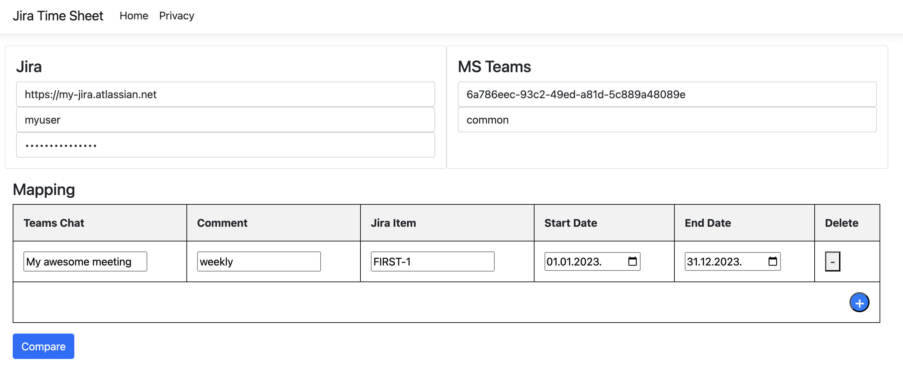
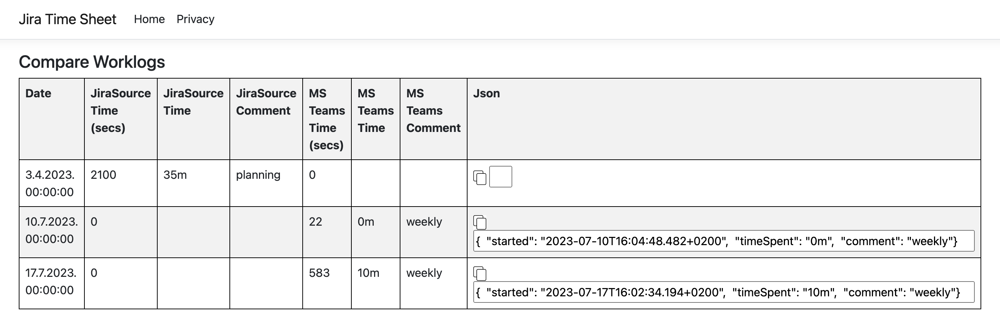

# Fill Jira Timesheet
Application for filling Jira timesheet with data from Microsoft Teams meetings. Microsoft Graph API is used to get data from Teams, and Jira REST API is used to fill out the timesheet.

